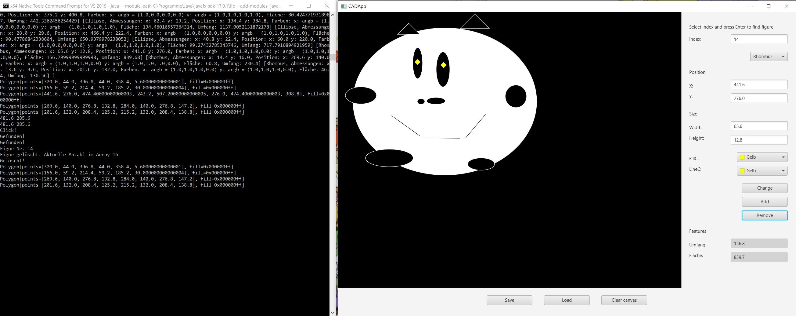

# About This Project
Canvas application created in JavaFX as a semester project for the programming I&II university classes.

# Functionality
- Creating and changing ellipse, rhombus, triangle or rectangle objects via mouse drag or size tupel input
- Changing border and filling colors
- Selecting existing objects via mouse click or index
- Deleting existing objects
- Saving and loading of the drawing

# Installation

The compiled programm can be exectured via command line. Change to the directory of download location and execute the jar file with

`java -jar LE12.jar`